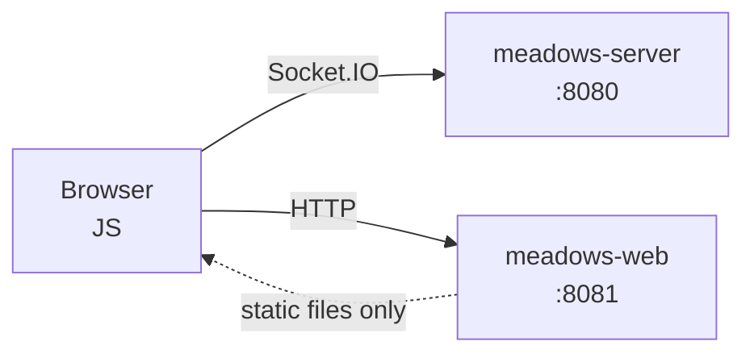

# meadows-web

> MEADOWS web host: a dumb HTTP host that serves `index.html` and static assets.
> No Socket.IO, no auth, no domain logic. The browser is the client; the
> Socket.IO connection runs browser→meadows-server, NOT via this Python webserver.
> See `MEADOWS-migration-intent.md` section 2 line 40 and section 4 line 115.

## Architecture



The browser connects directly to `meadows-server` via Socket.IO. This Python server is just a file host.

## What this package contains

- `app.py` — the Starlette ASGI app. Serves `/` → `dist/index.html` and `/static/*` → assets. Nothing else.
- `build.py` — template injection: reads `templates/index.html`, injects protocol constants + env config, writes `dist/index.html`.
- `templates/index.html` — minimal webchat page (Socket.IO client in the browser).
- `__main__.py` — `python -m meadows.web` entrypoint (uvicorn).

## Install

```bash
uv pip install -e ".[dev]"
```

This pulls in `meadows-protocol` (editable, via the sibling path) — the **only** MEADOWS dependency. The web host touches `meadows.protocol` solely to inject `EventName` constants into the template. It does **not** import `Message`, `JWTClaims`, or any domain model.

## Build the template

```bash
uv run python -m meadows.web.build
```

## Run

```bash
uv run python -m meadows.web
# or
uv run uvicorn meadows.web.app:app --host 0.0.0.0 --port 8081
```

### Run with Docker (self-hosted front-end)

Built from the repo root (so `../meadows-protocol` resolves — see `Dockerfile`)
and tagged `remcoboerma/meadows-web`. The image renders the template on every
container start, so the Socket.IO hostname is taken from the run-time env:

```bash
docker compose build          # or: ew build
docker run -d -p 8081:8081 \
  -e MEADOWS_SERVER_URL=http://chat.example.com remcoboerma/meadows-web
```

Then open <http://localhost:8081> — the page opens its own Socket.IO connection
straight to `MEADOWS_SERVER_URL` (browser → meadows-server, never through this
host). `MEADOWS_SYSTEM_NAME` is injected the same way.

## Test

```bash
uv run pytest -q
```

## Architecture invariants

1. **Dumb host.** No Socket.IO, no auth, no JWT, no message parsing. It serves files. Period.
2. **TLS is not a concern.** Traefik terminates TLS (section 4 line 115). No cert logic here.
3. **Protocol constants only.** The only import from `meadows.protocol` is `EventName` (for template injection).
4. **PEP 420 namespace.** `src/meadows/web/__init__.py` exists; there is NO `src/meadows/__init__.py`.

## Configuration (env vars, managed via `check_env` in `tasks.py:setup`)

| variable | default | purpose |
|---|---|---|
| `MEADOWS_WEB_HOST` | `0.0.0.0` | bind address for uvicorn |
| `MEADOWS_WEB_PORT` | `8081` | bind port for uvicorn |
| `MEADOWS_SERVER_URL` | `http://localhost:8080` | server URL injected into the page (browser Socket.IO target) |
| `MEADOWS_SYSTEM_NAME` | `MEADOWS Chat` | display name injected into the page |
| `PROJECT` | `meadows` | Traefik router prefix |
| `HOSTINGDOMAIN` | `localhost` | Traefik host domain |
